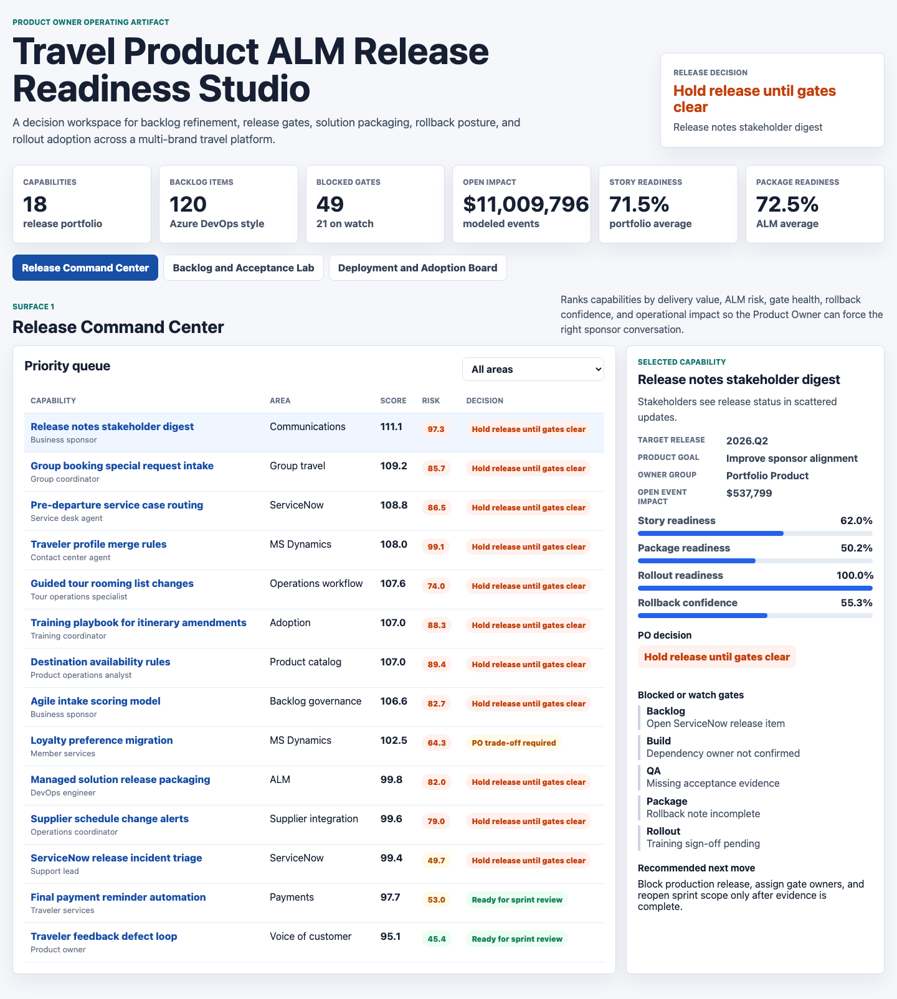
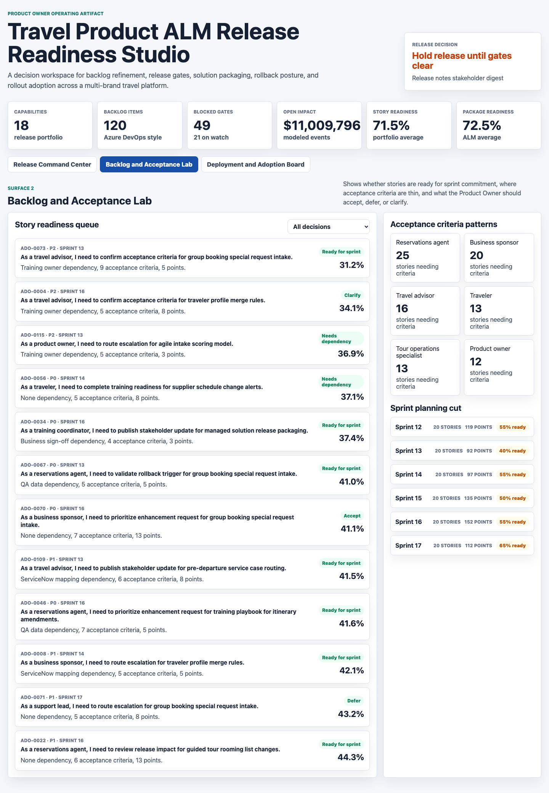
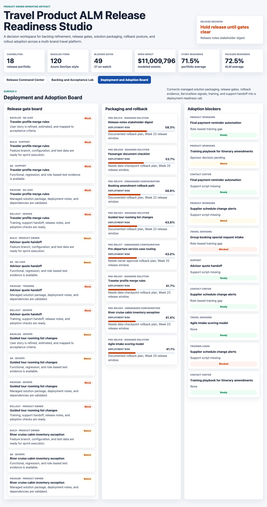

# Travel Product ALM Release Readiness Studio

Product Owner portfolio artifact for a multi-brand travel and tour platform. The studio models how an Agile Product Owner can translate business requests into sprint-ready stories, acceptance criteria, release gates, solution package checks, rollback decisions, and rollout adoption plans.

## Portfolio surfaces

### Release Command Center



Caption: The command center ranks product capabilities by delivery value, release risk, blocked gates, rollback posture, and modeled operational impact so sponsors can see which release decisions need Product Owner trade-offs.

### Backlog and Acceptance Lab



Caption: The backlog lab surfaces Azure DevOps-style stories, acceptance decisions, dependencies, acceptance criteria counts, sprint targets, and readiness scores so the Product Owner can accept, defer, clarify, or move stories into sprint planning.

### Deployment and Adoption Board



Caption: The deployment board connects release gates, managed solution package readiness, rollback plans, training readiness, support handoff, and adoption blockers into one release readiness call.

## Why this artifact

The target role is not just a reporting role. It asks for Agile product ownership, business analysis, process mapping, Scrum practices, Azure DevOps ALM, solution packaging, release management, rollback strategy, stakeholder communication, and rollout adoption. This project is therefore a Product Owner decision studio rather than a plain dashboard.

It demonstrates:

- Converting product vision and stakeholder requests into a prioritized backlog.
- Writing and evaluating user stories with acceptance criteria and dependencies.
- Making day-to-day scope, sprint, release, and rollback trade-offs.
- Connecting ALM gates, solution packaging, QA, ServiceNow-style signals, training, and support handoff.
- Communicating release decisions in a format sponsors and delivery teams can act on.

## Data

The data is synthetic because real Azure DevOps, MS Dynamics, ServiceNow, deployment, and training records for a travel platform are private operational data. The synthetic data is generated with a fixed random seed in `scripts/score_operating_data.py` so the project is reproducible.

The generator models common Agile and ALM structures:

- `data/entities.csv`: 18 travel product capabilities with business problem, desired outcome, value, user need, process complexity, dependency risk, story readiness, package readiness, rollout readiness, rollback confidence, and adoption risk.
- `data/backlog_items.csv`: 120 Azure DevOps-style epics, features, stories, and enablers with personas, priorities, acceptance criteria counts, dependencies, sprint targets, QA status, and Product Owner acceptance decisions.
- `data/release_gates.csv`: backlog, build, QA, package, and rollout gates with owners, evidence requirements, blockers, and due dates.
- `data/deployment_packages.csv`: managed solution, unmanaged configuration, and workflow package readiness with rollback plan status and deployment risk.
- `data/adoption_plan.csv`: training readiness, expected adoption, release note status, support handoff, and adoption blockers by cohort.
- `data/source_events.csv`: enhancement requests, QA defects, release incidents, training questions, sponsor decisions, and ServiceNow-style changes.

The scoring logic combines delivery value and release risk. Delivery value uses business value, user need, story readiness, package readiness, rollout readiness, and rollback confidence. Release risk increases when dependencies, blocked gates, QA defects, ServiceNow-style items, incomplete training, or weak rollback evidence appear.

The data does not represent real company performance or any private system export.

## Analysis outputs

- `analysis/outputs/app_payload.json`: UI payload consumed by the static studio.
- `analysis/outputs/priority_queue.csv`: scored Product Owner release decision queue.
- `analysis/outputs/backlog_readiness_queue.csv`: lowest-readiness backlog items for refinement.
- `analysis/outputs/release_gate_queue.csv`: blocked and watch release gates.
- `analysis/outputs/adoption_readiness_queue.csv`: adoption cohorts that need training or support follow-up.
- `analysis/executive_findings.md`: concise findings and recommendations.
- `analysis/methodology.md`: scoring method and synthetic data assumptions.
- `analysis/sql_checks.sql`: SQL checks a team could adapt for real ALM tables.

## Scope

This project does:

- Provide a working static product artifact with three distinct operational surfaces.
- Generate reproducible synthetic ALM data and scored outputs.
- Show how a Product Owner can prioritize backlog, release, rollback, and adoption decisions.

This project does not:

- Connect to live Azure DevOps, MS Dynamics, ServiceNow, or training systems.
- Claim that the data reflects any real travel company operations.
- Replace formal release governance, security review, or production change approval.

## Run locally

```bash
npm install
npm run analyze
npm start
```

Open `http://localhost:4173`.
